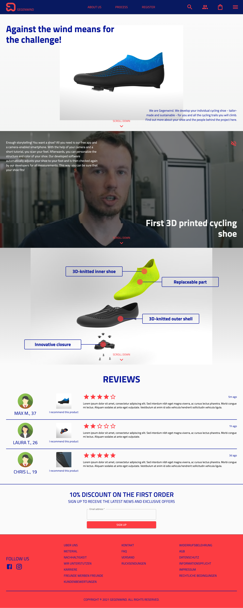

<div id="top"></div>

<!-- PROJECT LOGO -->
<br />
<div align="center">
  <a href="https://gegenwind2022.github.io/gegenwind/">
    
  </a>

  <h3 align="center">Gegenwind Web Shop Prototype</h3>

  <p align="center">
    A prototype of Gegenwind's new web shop to jumpstart the application development.
    <br />
    <br />
    <a href="https://gegenwind2022.github.io/gegenwind/">View Demo</a>
  </p>
</div>

<!-- TABLE OF CONTENTS -->
<details>
  <summary>Table of Contents</summary>
  <ol>
    <li>
      <a href="#about-the-prototype">About the prototype</a>
    </li>
    <li>
      <a href="#getting-started">Getting started</a>
      <ul>
        <li><a href="#prerequisites">Prerequisites</a></li>
        <li><a href="#installation">Installation</a></li>
      </ul>
    </li>
    <li><a href="#license">License</a></li>
    <li><a href="#contact">Contact</a></li>
  </ol>
</details>

<!-- ABOUT THE PROTOTYPE -->

## About the prototype



This web shop prototype was built in collaboration with team Gegenwind as part of Inside StartUp course at HBKsaar. The prototype aims to develop a web shop that will introduce you to individual cycling shoes that are tailor-made and sustainable for all bike paths you will climb. You will also find out more about different shoe features, user registration and people behind the project here.

Of course, this prototype will only serve to jumpstart the fully functional web shop development in future and the final requirements may be different. So more features will be added later.

<p align="right">(<a href="#top">back to top</a>)</p>

### Built with

This section lists all major frameworks, libraries and languages used to bootstrap the project.

- [React.js](https://reactjs.org/)
- [MUI](https://mui.com/)
- [TypeScript](https://www.typescriptlang.org/)

<p align="right">(<a href="#top">back to top</a>)</p>

<!-- GETTING STARTED -->

## Getting started

To start the development server, you need to meet the following prerequisites on your system and then perform the installation:

### Prerequisites

- npm
- Node.js
- Git

### Installation

```sh
npm install
npm start
```

<p align="right">(<a href="#top">back to top</a>)</p>

<!-- LICENSE -->

## License

Permission is hereby granted to Gegenwind for obtaining a copy of this software and associated documentation files (the "Software"), to deal in the Software without restriction, including without limitation the rights
to use, copy, modify, merge and/or publish copies of the Software, and to permit persons to whom the Software is furnished to do so, subject to the following conditions:

THE SOFTWARE IS PROVIDED "AS IS", WITHOUT WARRANTY OF ANY KIND, EXPRESS OR IMPLIED, INCLUDING BUT NOT LIMITED TO THE WARRANTIES OF MERCHANTABILITY, FITNESS FOR A PARTICULAR PURPOSE AND NONINFRINGEMENT. IN NO EVENT SHALL THE AUTHORS OR COPYRIGHT HOLDERS BE LIABLE FOR ANY CLAIM, DAMAGES OR OTHER LIABILITY, WHETHER IN AN ACTION OF CONTRACT, TORT OR OTHERWISE, ARISING FROM, OUT OF OR IN CONNECTION WITH THE SOFTWARE OR THE USE OR OTHER DEALINGS IN THE SOFTWARE.

The images and content used in this prototype were meant for educational purposes only.

<p align="right">(<a href="#top">back to top</a>)</p>

<!-- CONTACT -->

## Contact

Sabbir - s8srahme@stud.uni-saarland.de
<br />
Lukas - lukas@gegenwind.net

<p align="right">(<a href="#top">back to top</a>)</p>

<!-- ACKNOWLEDGMENTS -->

## Acknowledgments

Special thanks to Hannes Kaefer (h.kaefer@hbksaar.de) for the guidance and feedback.

<p align="right">(<a href="#top">back to top</a>)</p>
